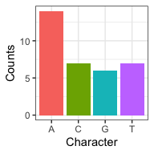

[**click to view group 25’s GitHub
Repository**](https://github.com/rforbiodatascience23/group_25_package)

# group_25_CentralDogma

This package can be used to replicate the central dogma of molecular
biology. The central dogma of biology describes the flow of genetic
information: DNA is transcribed into RNA, which is then translated into
proteins.

Dependencies for this package: ggplot2 and stringr.

## Library Loading

``` r
library(centraldogma)
```

## Function Descriptions

### generate_DNA

This function creates a random DNA sample of user-defined length (input
is an integer defining DNA_length).

**Example**

``` r
generate_DNA(10)
#> [1] "GGTCAATCCC"
```

### transcription

Transcribes the DNA sequence to RNA by substitution of the amino acid
‘T’ with ‘U’. The input is a DNA sequence given as a string.

**Example**

``` r
transcription("ATCG")
#> [1] "AUCG"
```

### mRNA_to_codons

This function splits the mRNA sequence into codons. Inputs are the
position at which to start at (int, Default is 1) and the mRNA sequence.
It returns a list of codons.

**Example**

``` r
# Define an illustrative mRNA sequence (replace with a real sequence when using the package)
mRNA_seq <- "AACCCGTTAAAGGATCTGTAACAATACTGGACAA"

# Use the defined mRNA sequence in the function
mRNA_to_codons(mRNA_seq)
#>  [1] "AAC" "CCG" "TTA" "AAG" "GAT" "CTG" "TAA" "CAA" "TAC" "TGG" "ACA"
```

### translation

The function translates from codons to amino acid sequences. Input
(codons) is a list of codons to translate and output is a string of
amino acid sequences.

``` r
translation("UUU")
#> [1] "F"
```

### plot_character_frequency

This function takes a string as input and plots a bar chart showing the
frequency of each unique character in the string. The plot is generated
using ggplot2.

``` r
plot_character_frequency(mRNA_seq)
```

<!-- -->

### Dependencies for Function Five (plot_character_frequency)

For the function
[plot_character_frequency](https://github.com/rforbiodatascience23/group_25_package/blob/master/R/plot_character_frequency.R),
I used `ggplot2` for plotting and `stringr` for string manipulation.
Added via `@importFrom` in Roxygen comments. By specifying the functions
I need, I keep the package lightweight and reduce potential conflicts
with other packages.

### Limits on the Number of Dependencies

We limited dependencies to `ggplot2` and `stringr` to keep the package
lightweight and avoid conflicts. While adding more could enhance the
functionality, it would also complicate the maintenance.

### Compare Approaches for Importing Functions

We chose to use `@importFrom` to import only what is needed, making the
package efficient. Using `package::function()` could clutter our code,
so we avoided it for clarity.
